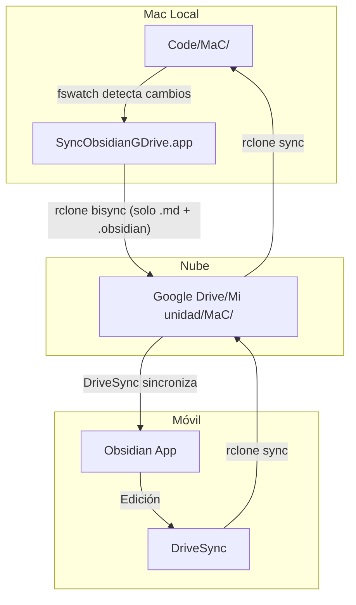

# Sincronización Obsidian ↔ Google Drive con rclone (macOS)

Cómo sincronizar en macOS bidireccionalmente los Markdown de repositorios locales hacia Google Drive para consumirlos en Obsidian móvil, sin contaminar la nube con archivos `.git`.

## El problema

Obsidian en el teléfono necesita que los archivos estén en Google Drive (vía DriveSync o similar). Pero tener repositorios Git dentro de `CloudStorage/GoogleDrive-*/` tiene dos problemas graves:

1. **Race conditions:** Google Drive sincroniza objetos de `.git/` mientras Git los construye, corrompiendo el repositorio.
2. **Tamaño excesivo:** `.git/` puede sumar gigabytes y miles de archivos diminutos inútiles para Obsidian.

## La solución: rclone como filtro local bidireccional

Usamos `rclone bisync` para transferir **solo** `.md` y `.obsidian/` desde la carpeta de trabajo (`Code/MaC`) hacia la carpeta sincronizada por el cliente oficial de Google Drive (`CloudStorage/`). Google Drive sube automáticamente los archivos resultantes a la nube sin enterarse de que existe un `.git`.

El proceso es bidireccional: lo que edites en el teléfono bajará a `CloudStorage/` y `rclone` lo devolverá a `Code/MaC`.

### Prerrequisitos

```bash
brew install rclone fswatch
```

No es necesario ejecutar `rclone config`. Operaremos estrictamente entre carpetas locales. Busca en la documentación de rclone si quieres acceder directamente a la nube sin pasar por el cliente Google Drive local.

---

## Paso 1: Inicialización (una sola vez)

`rclone bisync` necesita construir una base de datos del estado inicial de ambas carpetas. Ejecuta este comando **una única vez** con el flag `--resync`:

```bash
rclone bisync "$HOME/Code/MaC" "$HOME/Library/CloudStorage/GoogleDrive-<tu-correo@gmail.com>/Mi unidad/MaC" \
  --filter "+ *.md" \
  --filter "+ .obsidian/**" \
  --filter "- **" \
  --modify-window 1s \
  --resync
```

> [!warning] `--modify-window 1s`
> El sistema de archivos FUSE de Google Drive (`CloudStorage/`) tiene precisión de nanosegundos distinta a APFS. Sin esta tolerancia, `bisync` detectará diferencias fantasma de ~100 ns en los timestamps y abortará con error `path1 and path2 are out of sync`.

**Explicación de los filtros (el orden importa):**

| Filtro | Efecto |
|---|---|
| `--filter "+ *.md"` | Incluye todos los archivos Markdown en cualquier subcarpeta. |
| `--filter "+ .obsidian/**"` | Incluye la configuración del vault de Obsidian. |
| `--filter "- **"` | Excluye todo lo demás (`.git/`, `.DS_Store`, scripts, binarios, etc.) |

> [!tip] Dry-run
> Agrega `--dry-run -v` para ver qué se transferiría sin mover nada.

---

## Paso 2: Sincronización manual

Para el día a día, el mismo comando **sin** `--resync`:

```bash
rclone bisync "$HOME/Code/MaC" "$HOME/Library/CloudStorage/GoogleDrive-<tu-correo@gmail.com>/Mi unidad/MaC" \
  --filter "+ *.md" \
  --filter "+ .obsidian/**" \
  --filter "- **" \
  --modify-window 1s
```

> [!warning] Manejo de conflictos
> Si el mismo archivo cambió en ambos lados desde la última sincronización, `rclone bisync` no sobrescribirá ninguno. Renombrará una de las copias con sufijo `.path1` / `.path2` para que decidas manualmente cuál conservar.

---

## Paso 3: Automatización como demonio (launchd + fswatch)

Para que la sincronización ocurra automáticamente cada vez que modificas un archivo, sin intervención manual ni cron, usamos `fswatch` como vigía y `launchd` como demonio nativo de macOS.

### 3.1 Script de sincronización con batching

Crear el archivo `~/scripts/sync-obsidian-gdrive.sh`:

```bash
#!/bin/bash
# sync-obsidian-gdrive.sh
# Sincronización bidireccional MaC ↔ Google Drive (solo .md y .obsidian)
#
# Diseñado para ejecutarse como demonio vía launchd.
# fswatch detecta cambios y dispara rclone bisync con un cooldown
# para evitar ejecuciones excesivas (Obsidian auto-guarda con cada tecla).

ORIGEN="$HOME/Code/MaC"
DESTINO="$HOME/Library/CloudStorage/GoogleDrive-<tu-correo@gmail.com>/Mi unidad/MaC"
LOGFILE="$HOME/Library/Logs/sync-obsidian-gdrive.log"
LOCKFILE="/tmp/sync-obsidian-gdrive.lock"
COOLDOWN=30  # segundos mínimos entre sincronizaciones

FILTERS=(
  --filter "+ *.md"
  --filter "+ .obsidian/**"
  --filter "- **"
  --modify-window 1s
)

sync_now() {
  # Evitar ejecuciones paralelas
  if [ -f "$LOCKFILE" ]; then
    return
  fi
  touch "$LOCKFILE"

  # Rotación de log rápida (evita que el archivo crezca infinitamente)
  if [ -f "$LOGFILE" ] && [ $(wc -l < "$LOGFILE" | tr -d ' ') -gt 5000 ]; then
    tail -n 1000 "$LOGFILE" > "${LOGFILE}.tmp" && mv "${LOGFILE}.tmp" "$LOGFILE"
  fi

  echo "$(date '+%Y-%m-%d %H:%M:%S') 🔄 bisync iniciado" >> "$LOGFILE"
  rclone bisync "$ORIGEN" "$DESTINO" "${FILTERS[@]}" >> "$LOGFILE" 2>&1
  echo "$(date '+%Y-%m-%d %H:%M:%S') ✅ bisync completado" >> "$LOGFILE"

  rm -f "$LOCKFILE"
}

# --- Modo de ejecución ---
# Si se invoca con argumento "watch", entra en modo demonio (fswatch).
# Si se invoca sin argumentos, ejecuta una sincronización única.

if [ "${1}" = "watch" ]; then
  echo "$(date '+%Y-%m-%d %H:%M:%S') 👁️ Modo demonio iniciado (cooldown: ${COOLDOWN}s)" >> "$LOGFILE"

  # Sincronización inicial al arrancar
  sync_now

  # fswatch vigila solo archivos .md y cambios en .obsidian/
  # --latency: agrupa eventos durante N segundos antes de disparar (batching)
  # --recursive: vigila subcarpetas
  # -e: excluye patrones (evita disparos por .git, .DS_Store, etc.)
  fswatch --latency "$COOLDOWN" --recursive \
    -e "\.git" -e "\.DS_Store" -e "__pycache__" \
    -i "\.md$" -i "\.obsidian" \
    "$ORIGEN" "$DESTINO" | while read -r event; do
      sync_now
  done
else
  sync_now
fi
```

Hacerlo ejecutable:
```bash
chmod +x ~/scripts/sync-obsidian-gdrive.sh
```

### 3.2 Wrapper `.app` (para Full Disk Access granular)

macOS otorga Full Disk Access por **binario ejecutor**, no por script. Si le das FDA a `/bin/bash`, cualquier script bash tendría acceso completo al disco. La solución es envolver el script en un bundle `.app` mínimo y darle FDA **solo a ese `.app`**.

**Crear la estructura del `.app`:**

```bash
# Crear el bundle
mkdir -p ~/Applications/SyncObsidianGDrive.app/Contents/MacOS

# Crear Info.plist del bundle
cat > ~/Applications/SyncObsidianGDrive.app/Contents/Info.plist << 'EOF'
<?xml version="1.0" encoding="UTF-8"?>
<!DOCTYPE plist PUBLIC "-//Apple//DTD PLIST 1.0//EN"
  "http://www.apple.com/DTDs/PropertyList-1.0.dtd">
<plist version="1.0">
<dict>
  <key>CFBundleIdentifier</key>
  <string>com.usuario.sync-obsidian-gdrive</string>
  <key>CFBundleName</key>
  <string>SyncObsidianGDrive</string>
  <key>CFBundleExecutable</key>
  <string>SyncObsidianGDrive</string>
  <key>CFBundleVersion</key>
  <string>1.0</string>
  <key>LSBackgroundOnly</key>
  <true/>
</dict>
</plist>
EOF
```

**Crear el ejecutable del `.app`** (un script bash con shebang que delega al script principal):

```bash
cat > ~/Applications/SyncObsidianGDrive.app/Contents/MacOS/SyncObsidianGDrive << 'EOF'
#!/bin/bash
export PATH="/opt/homebrew/bin:/usr/local/bin:/usr/bin:/bin:/usr/sbin:/sbin"
exec "$HOME/scripts/sync-obsidian-gdrive.sh" "$@"
EOF

chmod +x ~/Applications/SyncObsidianGDrive.app/Contents/MacOS/SyncObsidianGDrive
```

**Otorgar Full Disk Access al `.app`:**

1. Abre **Configuración del Sistema** > **Privacidad y seguridad** > **Acceso total al disco**.
2. Clic en `+`. En el diálogo de Finder, presiona `Cmd+Shift+G` para abrir "Ir a la carpeta" y escribe `~/Applications/SyncObsidianGDrive.app`.
3. Selecciona el `.app` y verifica que el interruptor quede activado.

> [!tip] Por qué funciona
> macOS identifica el proceso por su `CFBundleIdentifier` (`com.usuario.sync-obsidian-gdrive`). Solo este `.app` específico tiene acceso al disco completo; `/bin/bash` sigue sin permisos elevados.

### 3.3 Agente launchd (demonio nativo de macOS)

Crear el archivo `~/Library/LaunchAgents/com.usuario.sync-obsidian-gdrive.plist`:

```xml
<?xml version="1.0" encoding="UTF-8"?>
<!DOCTYPE plist PUBLIC "-//Apple//DTD PLIST 1.0//EN"
  "http://www.apple.com/DTDs/PropertyList-1.0.dtd">
<plist version="1.0">
<dict>
  <key>Label</key>
  <string>com.usuario.sync-obsidian-gdrive</string>

  <key>ProgramArguments</key>
  <array>
    <string>/Users/<tu-usuario>/Applications/SyncObsidianGDrive.app/Contents/MacOS/SyncObsidianGDrive</string>
    <string>watch</string>
  </array>

  <key>RunAtLoad</key>
  <true/>

  <key>KeepAlive</key>
  <true/>

  <key>StandardOutPath</key>
  <string>/Users/<tu-usuario>/Library/Logs/sync-obsidian-gdrive.log</string>

  <key>StandardErrorPath</key>
  <string>/Users/<tu-usuario>/Library/Logs/sync-obsidian-gdrive.log</string>
</dict>
</plist>
```

> [!note] Rutas absolutas en macOS
> Los archivos `.plist` de `launchd` no soportan la expansión de variables como `$HOME`. Por eso, aquí **debes escribir manualmente** la ruta estática `/Users/<tu-usuario>/` con tu usuario en blanco.

> [!tip] Diferencias con la versión sin `.app`
> - `ProgramArguments` apunta al ejecutable dentro del bundle, no a `/bin/bash`.
> - No necesita `EnvironmentVariables` porque el `PATH` está declarado dentro del ejecutable del `.app`.

### 3.4 Activar y controlar el demonio

```bash
# Cargar (inicia inmediatamente y arrancará con cada login)
launchctl load ~/Library/LaunchAgents/com.usuario.sync-obsidian-gdrive.plist

# Verificar que está corriendo
launchctl list | grep sync-obsidian

# Detener temporalmente
launchctl unload ~/Library/LaunchAgents/com.usuario.sync-obsidian-gdrive.plist

# Ver logs en tiempo real
tail -f ~/Library/Logs/sync-obsidian-gdrive.log
```

---

## Diagrama de flujo



**Dirección:** Bidireccional. Las ediciones en el teléfono se propagan de vuelta a `Code/MaC` en la siguiente ejecución de `bisync`.

---

## Checklist de implementación

- [ ] ¿`rclone` y `fswatch` instalados? (`brew install rclone fswatch`)
- [ ] ¿Base de datos inicial construida con `--resync`?
- [ ] ¿Script `~/scripts/sync-obsidian-gdrive.sh` creado y ejecutable?
- [ ] ¿Bundle `~/Applications/SyncObsidianGDrive.app` creado?
- [ ] ¿Full Disk Access otorgado a `SyncObsidianGDrive.app`?
- [ ] ¿`.plist` creado en `~/Library/LaunchAgents/`?
- [ ] ¿Demonio cargado con `launchctl load`?
- [ ] ¿DriveSync en el teléfono apuntando a `Mi unidad/MaC`?
